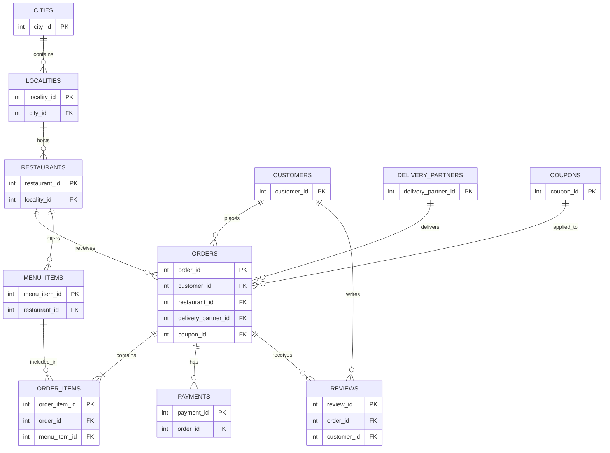

```mermaid
erDiagram
    CITIES ||--o{ LOCALITIES : contains
    LOCALITIES ||--o{ RESTAURANTS : hosts
    CUSTOMERS ||--o{ ORDERS : places
    RESTAURANTS ||--o{ ORDERS : receives
    RESTAURANTS ||--o{ MENU_ITEMS : offers
    DELIVERY_PARTNERS ||--o{ ORDERS : delivers
    COUPONS ||--o{ ORDERS : applied_to
    ORDERS ||--|{ ORDER_ITEMS : contains
    MENU_ITEMS ||--o{ ORDER_ITEMS : included_in
    ORDERS ||--o{ PAYMENTS : has
    ORDERS ||--o{ REVIEWS : receives
    CUSTOMERS ||--o{ REVIEWS : writes

    CITIES {
        int city_id PK
    }

    LOCALITIES {
        int locality_id PK
        int city_id FK
    }

    CUSTOMERS {
        int customer_id PK
    }

    RESTAURANTS {
        int restaurant_id PK
        int locality_id FK
    }

    MENU_ITEMS {
        int menu_item_id PK
        int restaurant_id FK
    }

    DELIVERY_PARTNERS {
        int delivery_partner_id PK
    }

    COUPONS {
        int coupon_id PK
    }

    ORDERS {
        int order_id PK
        int customer_id FK
        int restaurant_id FK
        int delivery_partner_id FK
        int coupon_id FK
    }

    ORDER_ITEMS {
        int order_item_id PK
        int order_id FK
        int menu_item_id FK
    }

    PAYMENTS {
        int payment_id PK
        int order_id FK
    }

    REVIEWS {
        int review_id PK
        int order_id FK
        int customer_id FK
    }
```